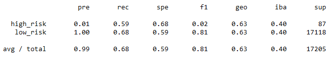
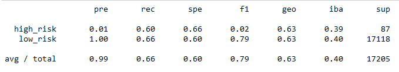
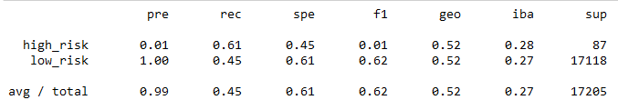
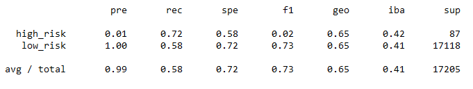
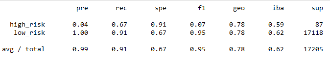

# Credit Risk Analysis

## Overview
Resampling data with `imbalanced-learn` and `scikit-learn` libraries to build, evaluate and compare four Logistic Regression models `RandomOverSampler`, `SMOTE`, `ClusterCentroids` and `SMOTEENN` with two Ensemble Learners `BalancedRandomForestClassifier` and `EasyEnsembleClassifier` that predict credit risk.

## Results

Figure 1.) Oversampling with `RandomOverSampler`.

* Oversampling using `RandomOverSampler`: high risk accuracy of 1%, precision 59%; low risk accuracy of 100%, precision 68%.

Figure 2.) Oversampling with `SMOTE`.

* Oversampling using `SMOTE`: high risk accuracy of 1%, precision 60%; low risk accuracy of 100%, precision 66%.

Figure 3.) Undersampling with `ClusterCentroids`.

* Oversampling using `ClusterCentroids`: high risk accuracy of 1%, precision 61%; low risk accuracy of 100%, precision 45%.

Figure 4.) Undersampling with `SMOTEENN`.

* Oversampling using `SMOTEENN`: high risk accuracy of 1%, precision 72%; low risk accuracy of 100%, precision 58%.

Figure 5.) Ensemble Learner with `BalancedRandomForestClassifier`.

* Ensemble Learner using `BalancedRandomForestClassifier`: high risk accuracy of 4%, precision 67%; low risk accuracy of 100%, precision 91%.

